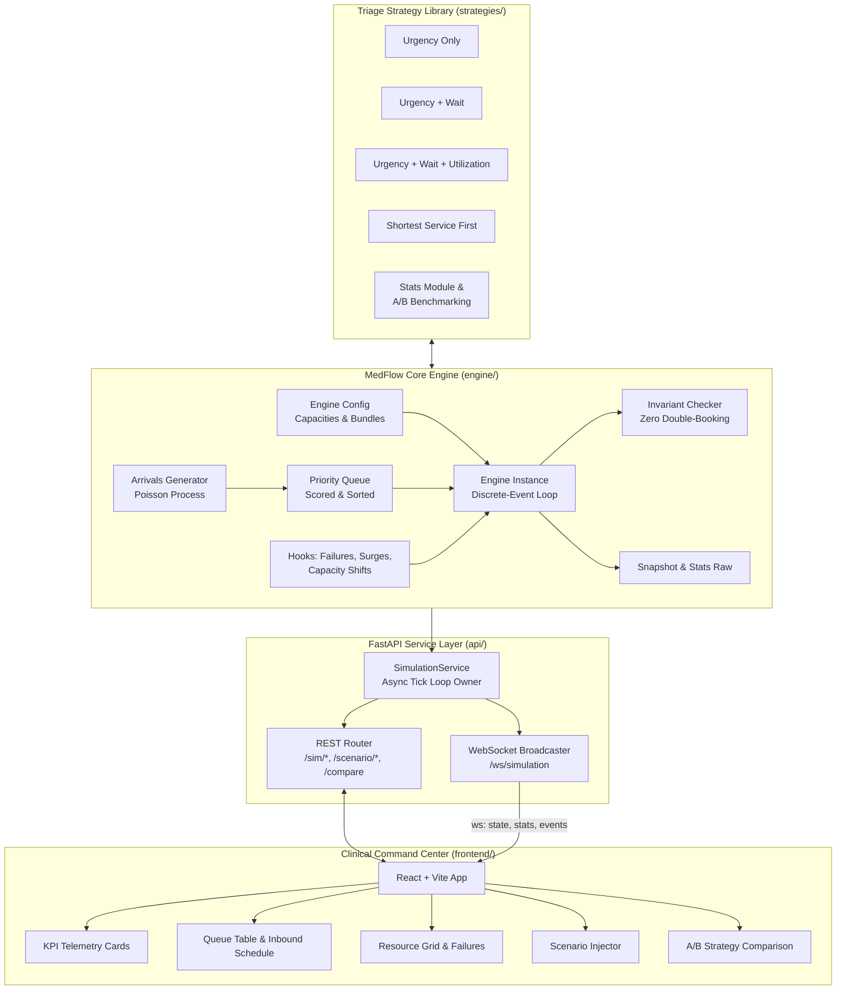

# Vitalis — Hospital Resource Intelligence & Emergency Triage Simulator

[](https://www.python.org/downloads/)
[](https://fastapi.tiangolo.com)
[](https://react.dev/)
[](https://www.typescriptlang.org/)
[](LICENSE)

**Vitalis** is a full-stack, real-time hospital resource management and emergency department (ED) triage simulator. Powered by the **MedFlow** deterministic discrete-event simulation engine, Vitalis models acute patient inflows, multi-resource atomic bundling (Beds, ICU Beds, Operating Rooms, Doctors, Nurses, Ambulances), dynamic triage policies, equipment failures, and mass-casualty surges.

Vitalis pairs a mathematically verifiable Python simulation library with a live FastAPI WebSocket service and an interactive clinical command center dashboard built in React and TypeScript.

---

## 📑 Table of Contents

- [System Overview](#-system-overview)
- [Key Features](#-key-features)
- [Architecture](#-architecture)
- [Prioritization Strategies](#-prioritization-strategies)
- [Scenarios & Stress Testing](#-scenarios--stress-testing)
- [Getting Started](#-getting-started)
  - [Prerequisites](#prerequisites)
  - [Backend Setup & Run](#1-backend-fastapi--simulation-engine)
  - [Frontend Setup & Run](#2-frontend-react--vite-dashboard)
- [Verification & Automated Tests](#-verification--automated-tests)
- [CLI Debug Harness](#-cli-debug-harness)
- [API & WebSocket Reference](#-api--websocket-reference)
- [Engine Invariants & Verification](#-engine-invariants--verification)

---

## 🏥 System Overview

Modern emergency departments face severe resource contention: critical patients requiring immediate multi-resource bundles (e.g., an ICU bed + specialized physician + critical-care nurse) arrive alongside ambulatory patients, while equipment breakdowns and staff shifts dynamically shift hospital capacity.

Vitalis solves and visualizes these operational challenges:
1. **Atomic Multi-Resource Bundling**: Allocations require simultaneous availability of all required resources (e.g. Bed + Doctor + Nurse). Partial allocations never occur, preventing resource deadlocks.
2. **Deterministic Discrete-Event Engine**: Headless, reproducible, time-stepped simulation core with zero floating-point clock drift and zero non-deterministic threading.
3. **Dynamic Starvation Prevention**: Balances life-saving critical care with anti-starvation mechanisms that guarantee non-urgent patients are not delayed indefinitely.
4. **Resilient Failure Recovery**: Models sudden equipment breakdowns, preemption (`P-FAIL`), service interruptions, and clinical recoveries.
5. **Headless A/B Benchmarking**: Evaluates scheduling strategies side-by-side across identical seeded Poisson arrival distributions.

---

## ✨ Key Features

- **Live Clinical Dashboard**: Real-time telemetry displaying bed and staff occupancy, queue depth, active treatment progress, and rolling wait times.
- **Queue Intelligence**: Distinguishes patients physically waiting in the ER from inbound scheduled arrivals with real-time ETA countdowns.
- **Pluggable Strategy Engine**: Switch between scoring heuristics on the fly (`Urgency Only`, `Urgency + Wait`, `Urgency + Wait + Utilization`, `Shortest Service First`).
- **Interactive Disruption Playground**: Inject emergency surges, staff shortages, and equipment failures on demand and observe systemic cascading effects.
- **Real-Time Event Stream**: Live audit trail capturing admissions, triage scores, resource assignments, discharges, and recovery events.
- **Comparative Strategy Analytics**: Side-by-side radar and statistical comparison of average wait times, $p_{95}$ wait times, starvation rates, and resource utilization.

---

## 🏛️ Architecture



### Module Responsibilities

| Module | Purpose | Tech Stack |
|---|---|---|
| **`engine/`** | Pure, deterministic discrete-event simulation core. Pure Python standard library only. | Python 3.11+, `dataclasses`, `heapq` |
| **`strategies/`** | Patient scoring formulas, starvation handling, and statistical post-processing. | Python 3.11+ |
| **`api/`** | REST controllers, async tick loop, WebSocket live streaming, demo loaders. | FastAPI, Uvicorn, WebSockets |
| **`frontend/`** | Responsive clinical interface, live charts, controls, and scenario triggers. | React 18, TypeScript, Vite, Recharts, Lucide |
| **`scripts/`** | Headless CLI debug harness and invariant verification runners. | Python CLI |

---

## 🧠 Prioritization Strategies

Vitalis evaluates patients every allocation pass using pluggable scoring strategies:

$$\text{Priority Score} = f(\text{Urgency Tier}, \text{Wait Time}, \text{Resource Contention}, \text{Predicted Service Time})$$

1. **Urgency Only (`urgency_only`)**
   - Pure Emergency Severity Index (ESI) triage.
   - Formula: $\text{Score} = (6 - \text{urgency}) \times 1000$.
   - Prioritizes critical life-threats immediately, but risks starving Tier 4 & 5 patients during elevated arrival volumes.
2. **Urgency + Wait (`urgency_wait`)**
   - Balances acuity with waiting room delays.
   - Formula: $\text{Score} = (6 - \text{urgency}) \times 1000 + 0.1 \times \text{wait\_seconds}$.
   - Linear wait aging ensures low-urgency patients are treated before exceeding acceptable thresholds.
3. **Urgency + Wait + Utilization (`urgency_wait_utilization`)**
   - Acute-care aware policy designed for constrained equipment (e.g. ICU beds).
   - Incorporates real-time availability ratios to prioritize patients whose required resources are currently unblocked, minimizing idle capacity while enforcing starvation safeguards.
4. **Shortest Service First (`shortest_service_first`)**
   - Prioritizes shorter service durations to maximize patient throughput, with urgency baselines to protect unstable patients.

---

## ⚡ Scenarios & Stress Testing

Vitalis ships with pre-configured operational stress scenarios accessible directly from the UI or REST API:

* **Normal Operations**: Standard baseline load ($\lambda = 3.5\text{ arrivals/hour}$) on a 20-bed hospital. Demonstrates high standby readiness and low average wait times ($< 1\text{m}$).
* **Emergency Surge**: Triples patient arrival rate ($\lambda = 10.5\text{ arrivals/hour}$) over a 1-hour window. Drives utilization to 85–95%, creates ER queues, and exercises queue re-ranking.
* **Staff Shortage**: Simulates unannounced nurse (16 $\rightarrow$ 6) and doctor (8 $\rightarrow$ 4) off-duty transitions. Highlights staffing bottlenecks when beds are available but personnel are missing.
* **Resource Failure**: Triggers sudden mechanical failure on specialized units (e.g., ICU Bed or OR), testing `P-FAIL` preemption, recovery timers, and triage re-allocation.
* **ICU Contention**: Injects multiple simultaneous Tier 1 critical patients requiring ICU beds and physicians, stressing scarcity handling.
* **Queue Jump Demo**: Demonstrates dynamic preemption and prioritization when a Tier 1 polytrauma arrival immediately overtakes lower-urgency patients in the queue.

---

## 🚀 Getting Started

### Prerequisites

- **Python**: Version 3.11 or newer installed.
- **Node.js**: Version 18.0 or newer (with `npm`).

---

### 1. Backend (FastAPI + Simulation Engine)

1. Clone or navigate to the project repository:
   ```bash
   cd vitalis
   ```

2. (Optional) Create and activate a Python virtual environment:
   ```bash
   python -m venv venv
   # On Windows:
   .\venv\Scripts\activate
   # On macOS/Linux:
   source venv/bin/activate
   ```

3. Install backend dependencies:
   ```bash
   pip install -r requirements.txt
   ```

4. Launch the FastAPI server:
   ```bash
   python -m uvicorn api.main:app --reload --port 8000
   ```

- **Interactive API Docs (Swagger)**: [http://localhost:8000/docs](http://localhost:8000/docs)
- **WebSocket Feed**: `ws://localhost:8000/ws/simulation`
- **Health Check**: [http://localhost:8000/health](http://localhost:8000/health)

---

### 2. Frontend (React + Vite Dashboard)

1. Open a second terminal window and navigate to the frontend directory:
   ```bash
   cd vitalis/frontend
   ```

2. Install frontend dependencies:
   ```bash
   npm install
   ```

3. Start the Vite development server:
   ```bash
   npm run dev
   ```
   *(On Windows PowerShell if script execution is restricted, run `cmd /c "npm run dev"` or `npx vite`)*

4. Open your browser to:
   ```text
   http://localhost:5173
   ```

---

## 🧪 Verification & Automated Tests

Vitalis is covered by an automated test suite verifying determinism, snapshot invariants, capacity scaling, strategy scoring, and API contract compliance.

### Run Backend Unit & Invariant Tests
From the project root:
```bash
python -m pytest tests -q
```
*Expected result:*
```text
134 passed, 20 subtests passed in ~18s
```

To run exclusively the core engine verification suite:
```bash
python -m pytest tests/engine -q
```
*Expected result:*
```text
89 passed in ~17s
```

### Build Frontend Production Bundle
From the `frontend` directory:
```bash
cd frontend
npm run build
```
*Expected result: TypeScript typecheck passes and production assets are generated into `frontend/dist/` without errors.*

---

## 🖥️ CLI Debug Harness

For headless benchmarks, testing, and debugging, Vitalis provides a command-line harness:

```bash
python scripts/run_cli.py --seed 42 --steps 10000 --debug-invariants
```

Key arguments:
- `--seed <int>`: Random seed for Poisson arrival generation.
- `--steps <int>`: Number of simulation steps to execute (default: `10000`).
- `--debug-invariants`: Validates strict mathematical engine invariants on every step.
- `--speed <float>`: Simulated seconds per tick.

---

## 📡 API & WebSocket Reference

### Simulation Control

| Method | Endpoint | Description |
|---|---|---|
| `POST` | `/sim/start` | Start the simulation tick loop with optional `{ speed, strategy }`. |
| `POST` | `/sim/pause` | Pause the simulation clock. |
| `POST` | `/sim/resume` | Resume the simulation clock. |
| `POST` | `/sim/reset` | Reset simulation state to $t = 0$ with initial seed. |
| `POST` | `/sim/speed` | Adjust clock speed multiplier (`{ speed: int }`). |
| `GET` | `/sim/status` | Current clock, run state, speed, active strategy, and patient counts. |
| `GET` | `/stats` | Computed wait times by urgency, resource utilization %, treated counts. |
| `POST` | `/allocate` | Manually trigger an immediate resource allocation pass. |

### Strategy & Scenarios

| Method | Endpoint | Description |
|---|---|---|
| `GET` | `/strategy` | List all available strategies and identify the active strategy. |
| `POST` | `/strategy` | Switch the active scoring strategy (`{ name: string }`). |
| `POST` | `/scenario/surge` | Inject an arrival surge multiplier (`{ multiplier: 3.0, duration_s: 3600 }`). |
| `POST` | `/scenario/capacity`| Adjust resource pool capacity (`{ type: "DOCTOR", n: 4 }`). |
| `POST` | `/scenario/fail` | Trigger a mechanical failure on a resource unit (`{ unit_id: int, duration_s: int }`). |
| `POST` | `/compare` | Run a headless A/B benchmark across multiple strategies on the same seed. |
| `POST` | `/demo/load` | Load scripted scenario presets (`"queue_jump"`, `"icu_contention"`, `"starvation"`). |

### WebSocket Telemetry (`/ws/simulation`)
Connect via `ws://localhost:8000/ws/simulation`. Emits three JSON frame types:
1. `{"type": "state", "data": <Snapshot>}`: Full engine snapshot (clock, resources, queue, active treatments, recent events).
2. `{"type": "stats", "data": <DisplayStats>}`: Aggregated KPIs, wait times by urgency tier, starvation counts, and utilization %.
3. `{"type": "events", "data": [<LogEvent>]}`: Real-time clinical event log.

---

## 🛡️ Engine Invariants & Verification

The MedFlow engine enforces continuous invariants (`assert_invariants(engine)`) to guarantee mathematical correctness:

1. **Resource Conservation**:
   $$\text{total}(R) = \text{free}(R) + \text{occupied}(R) + \text{failed}(R) + \text{off}(R) \quad \forall R \in \text{ResourceTypes}$$
2. **Zero Double-Booking**: Each resource unit ID appears in at most one active treatment or failure state.
3. **Atomic Multi-Resource Allocation**: Patients enter treatment if and only if **100%** of their required resource bundle is acquired simultaneously.
4. **Queue Integrity**: Only patients who have physically arrived ($\text{arrival\_time} \le \text{clock}$) and hold status `WAITING` are eligible for allocation.
5. **Preemption Recovery**: If a resource fails during active service, patients are transitioned to `P-FAIL` and placed back into priority queueing with preserved remaining treatment duration.
6. **Strict Determinism**: Zero reliance on wall-clock time (`time.time()`), system random, or hash randomization. All outcomes are strictly reproducible via seeded PRNG.

---

## 📄 License

This project is licensed under the MIT License — see the [LICENSE](LICENSE) file for details.